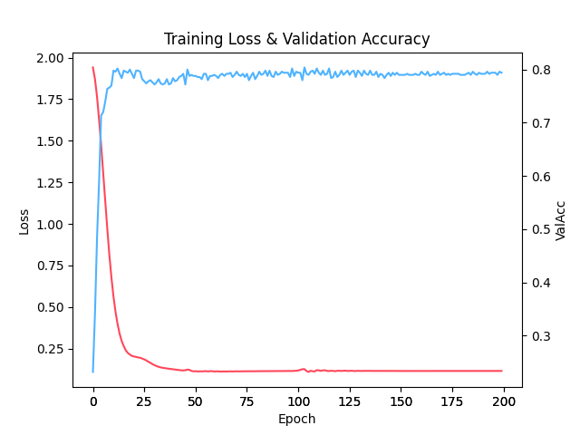

# gcn

GCN是2016年发表的模型，论文名称是《Semi-Supervised Classification with Graph Convolutional Networks》（图卷积网络的半监督分类）。

参考 [《深入浅出图神经网络：GNN原理解析》](https://github.com/FighterLYL/GraphNeuralNetwork) 中第5章代码。

## Use

### 实验环境

```
Python			3.10

torch			2.1.2
numpy			1.26.3
scipy			1.12.0
matplotlib		3.9.0
```

### 运行

```cmd
python train.py
```

测试结果

```
Test accuarcy:  0.8100000619888306
```

loss和验证集acc曲线



【实验数据集介绍】

实验使用[Cora数据集](https://github.com/kimiyoung/planetoid)，Cora数据集包含2708个节点， 5429条边，总共7种类别。每个节点代表一篇科学出版物，边表示出版物存在引用关系。

每个节点的特征向量是由一个1433维的词向量表示，向量值是0和1，1表示单词存在该出版物中，否则不存在。

data/cora文件夹中的数据集是经过处理好的，含义如下：

- ind.cora.x : 训练集节点特征向量，保存对象为：scipy.sparse.csr.csr_matrix，实际展开后大小为： (140, 1433)

- ind.cora.tx : 测试集节点特征向量，保存对象为：scipy.sparse.csr.csr_matrix，实际展开后大小为： (1000, 1433)

- ind.cora.allx : 包含有标签和无标签的训练节点特征向量，保存对象为：scipy.sparse.csr.csr_matrix，实际展开后大小为：(1708, 1433)，可以理解为除测试集以外的其他节点特征集合，训练集是它的子集

- ind.cora.y : one-hot表示的训练节点的标签，保存对象为：numpy.ndarray

- ind.cora.ty : one-hot表示的测试节点的标签，保存对象为：numpy.ndarray

- ind.cora.ally : one-hot表示的ind.cora.allx对应的标签，保存对象为：numpy.ndarray

- ind.cora.graph : 保存节点之间边的信息，保存格式为：{ index : [ index_of_neighbor_nodes ] }

- ind.cora.test.index : 保存测试集节点的索引，保存对象为：List，用于后面的归纳学习设置。


## 模型介绍

GCN的主要思想是**通过邻居节点的信息来更新每个节点的表示**。经过多层学习使得节点可以聚合到高阶邻居特征并用于下游任务。


假设有一个图数据集合，其中有`𝑁`个节点（node），每个节点都有自己的特征，我们设这些节点的特征组成一个𝑁×𝐷维的矩阵`𝑋`，然后各个节点之间的关系也会形成一个𝑁×𝑁维的矩阵`𝐴`，也称为邻接矩阵（adjacency matrix）。`𝑋`和`𝐴`便是我们模型的输入。

GCN的层与层之间的传播公式是：

$$  H^{(l+1)} = \sigma(\hat{D}^{-1/2}\hat{A}\hat{D}^{-1/2}H^{(l)}W^{(l)})  $$ 

其中：

-  $\hat{A}=A+I，I$ 是单位矩阵；
- $\hat{D}$ 是 $\hat{A}$ 的度矩阵（degree matrix），公式为 $\hat{D_{ii}}=\sum_j{\hat{A}_{ii}}$；
- H是隐藏层的特征，对于输入层,  $H^{(0)}=X$ ；  
- σ是非线性激活函数，模型中使用ReLU激活函数；
- W是训练权重矩阵。

在实际使用中，公式中的 $\hat{D}^{-1/2}\hat{A}\hat{D}^{-1/2}$ 是可以事先计算好，节省计算时间。

GCN运算维度变化分析，假设节点数量为N，特征维度是D，卷积输出维度是O，

公式中变量的向量维度如下：

$$a=a\*a$$

$$H=X\in{R^{N\*D}}, A=\hat{A}=\hat{D}\in{R^{N\*N}}，W\in{R^{D\*O}}$$


根据链式法则，一层GCN运算维度变化为：

$$(N\*\bcancel{N})\*(\bcancel{N}\*\bcancel{N})\*(\bcancel{N}\*\bcancel{N})\*(\bcancel{N}\*\bcancel{D})\*(\bcancel{D}\*O)=(N\*O)$$


> 从公式可以发现，这是将图结构运算转为MLP矩阵运算了。 
>
> 对于X节点特征向量的获取，如果有信息可以转为数据就直接使用，否则可以直接将节点向量作为训练参数学习，类似词向量。

### 论文实验结果


可以观察到，在Cora数据集中，使用X特征向量取得81.5%的准确率，使用随机初始化特征向量取得80.1%的准确率。

尽管GCN的效果很好，但存在一个**局限**就是**计算复杂度太高**，而且无论是测试集还是训练集，都要整张图一起训练学习。

## 参考

论文：https://arxiv.org/abs/1609.02907

[《深入浅出图神经网络：GNN原理解析》](https://github.com/FighterLYL/GraphNeuralNetwork)

[图卷积神经网络(GCN)入门 - Jamest - 博客园 (cnblogs.com)](https://www.cnblogs.com/hellojamest/p/11678324.html)

[图卷积网络(Graph Convolutional Networks, GCN)详细介绍-CSDN博客](https://blog.csdn.net/qq_43787862/article/details/113830925)

[如何理解 Graph Convolutional Network（GCN）？ - superbrother的回答 - 知乎 ](https://www.zhihu.com/question/54504471/answer/332657604)

[【数据集介绍】Cora数据集介绍-CSDN博客](https://blog.csdn.net/zfhsfdhdfajhsr/article/details/116137598)
